# MLP Final Project

# 웹툰의 성공적인 드라마화를 위한 배우 추천 시스템 

*웹툰을 드라마화 할 때, 웹툰 등장인물과 많은 유사성을 가진 배우를 추천해주는 시스템*

### :date: 프로젝트 일정​

- 06.28 ~ 07.02 주제 선정

- 07.04 ~ 07.10 데이터 수집, 데이터 전처리, 모델 테스트

- 07.11 ~ 07.17 프로토타입 제작

- 07.18 ~ 07.24 모델 성능 개선, 데이터 추가

- 07.25 ~ 07.31 프로토타입2 구현, 데이터 추가 및 정제

- 08.01 ~ 08.10 최종 시스템 구축(프로토타입2 개선), 웹 제작, ppt 제작 및 발표 준비

### :soon: Version History

- ProtoType_ver_0.1(2022.07.09)
  - jupyter notebook
  - basic ML model used
  - Data : webtoon - 590 / Actor - 227
- ProtoType_ver_0.2(2022.07.31)
  - modularity
  - inhanced ML model used
  - Data : webtoon - 590 / Actor - 1927
- Version_1.0(2022.08.11)
  - inhanced DL model used
  - streamlit
  - Deploy - AWS

### :minidisc: 데이터

- 웹툰 데이터
  - 완결웹툰 : 70개
  - 등장인물 정보 : 470개
  - 등장인물 이미지 : 470개
- 배우 데이터
  - 배우 정보 : 1746개
  - 배우 이미지 : 1746개
- StyleGAN 학습 데이터
  - 웹툰 등장인물 이미지 : 약 40만개
- AutoEncoder 학습 뎁이터
  - 사람 얼굴 이미지 : 10427개
  - 웹툰 등장인물 이미지 : 10427개

## :mag_right:프로젝트 개요 및 내용

1. 웹툰을 드라마화 할 때, 성공적인 배역 캐스팅을 위한 웹툰 캐릭터와 닮은 배우를 추천해주는 시스템.
2. 일반 사용자가 자신의 사진을 카툰화하고, 사용자와 가장 닮은 웹툰 캐릭터를 추천해주는 시스템

- 홈페이지

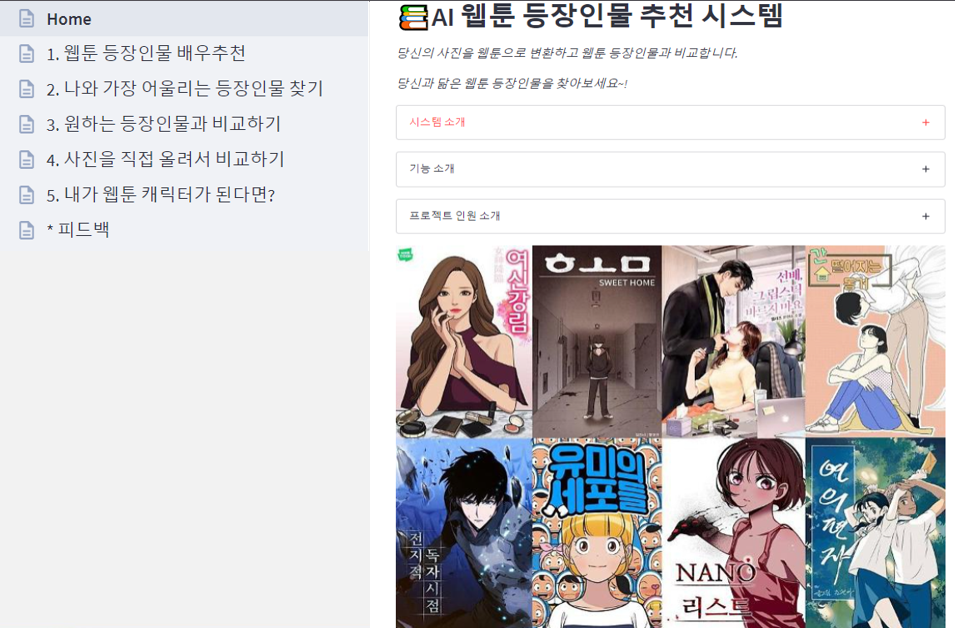

- Option 1 : 웹툰 등장인물과 어울리는 배우 찾기

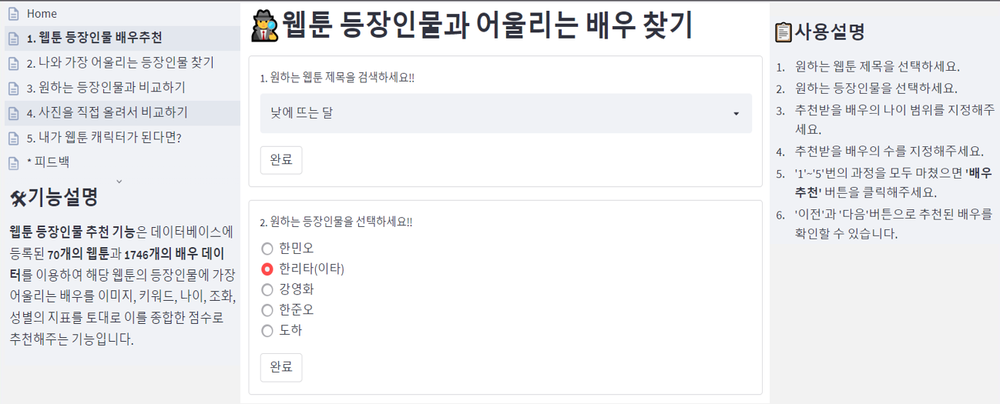

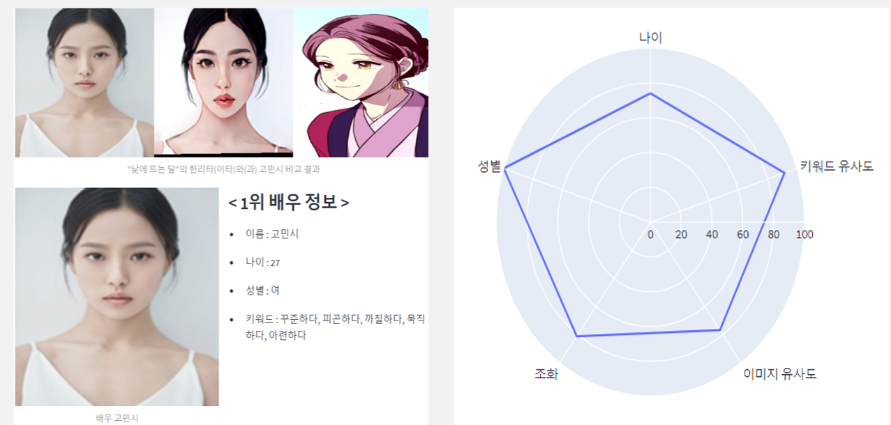

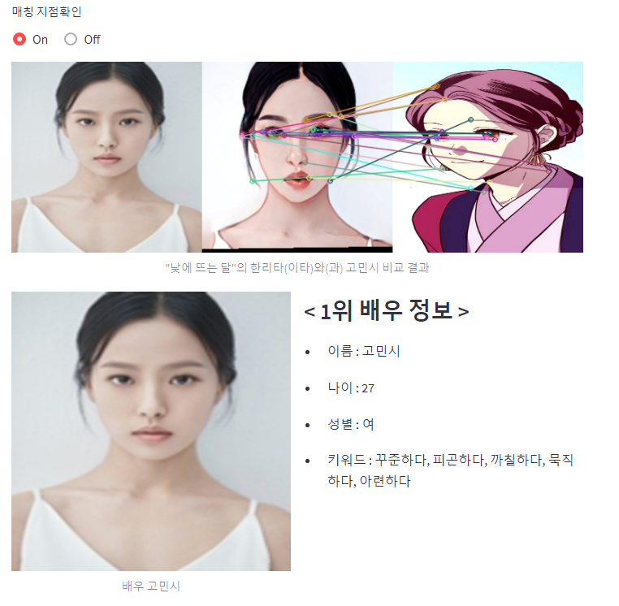

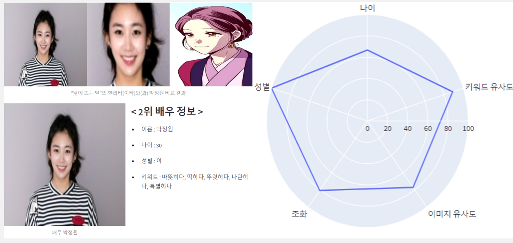

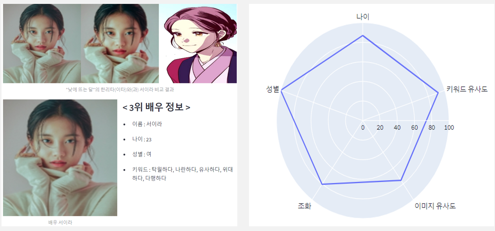

- Option 2 : 나와 어울리는 등장인물 찾기

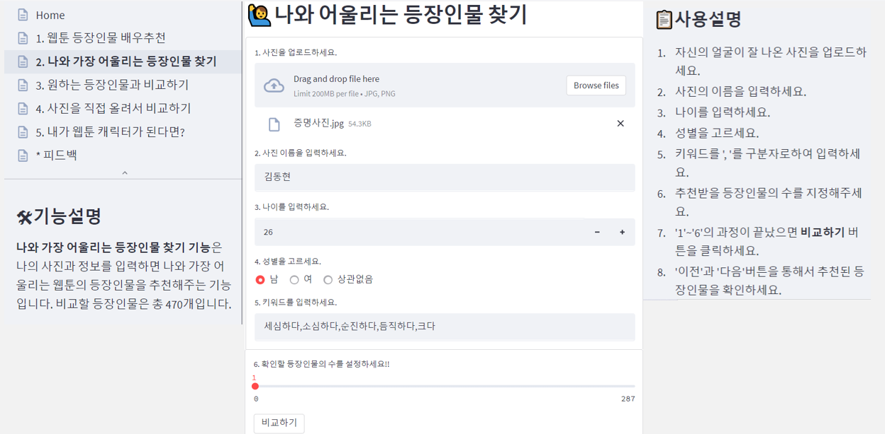

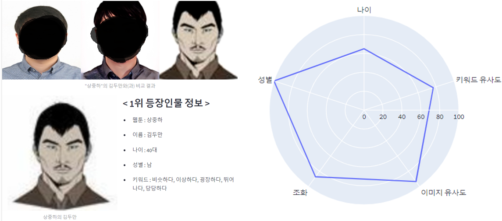

- Option 3 : 원하는 등장인물과 나를 비교하기

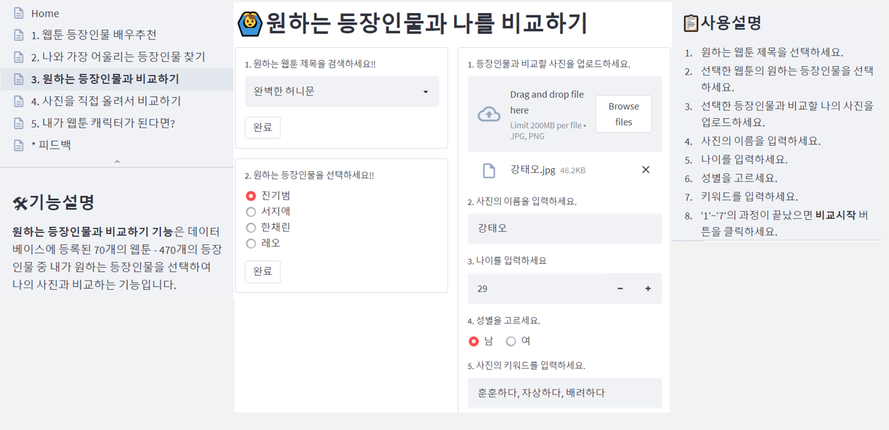

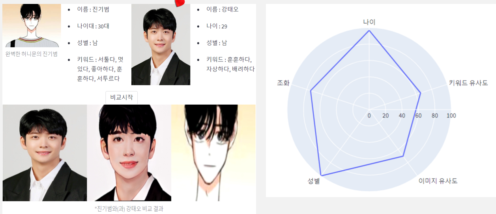

- Option - 4 : 직접 업로드한 등장인물과 비교하기

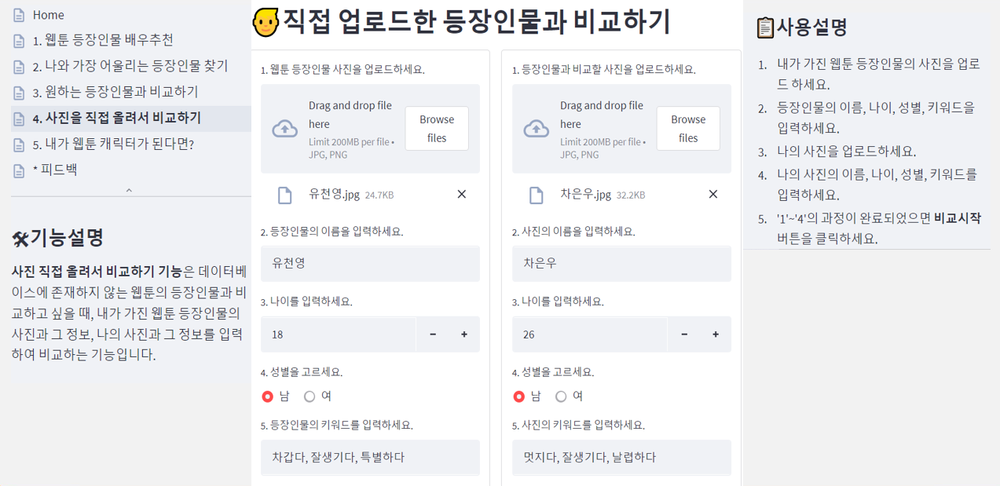

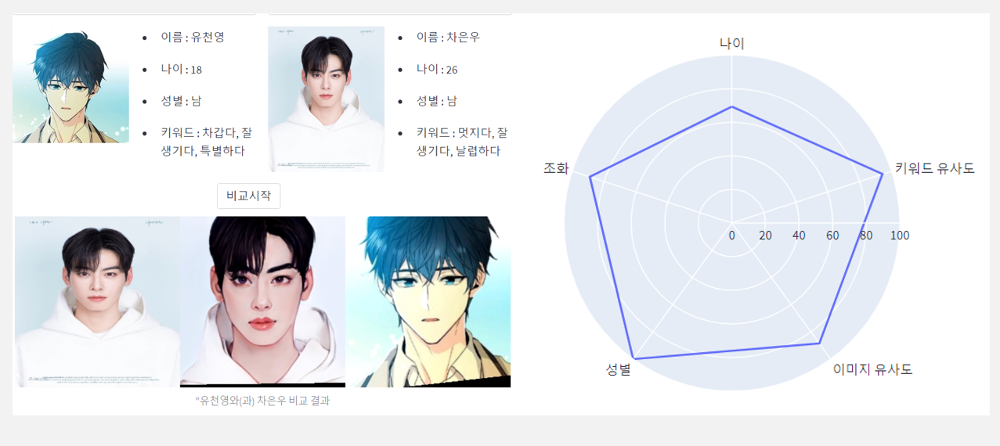

- Option 5 : 나를 웹툰 캐릭터로 변환하기

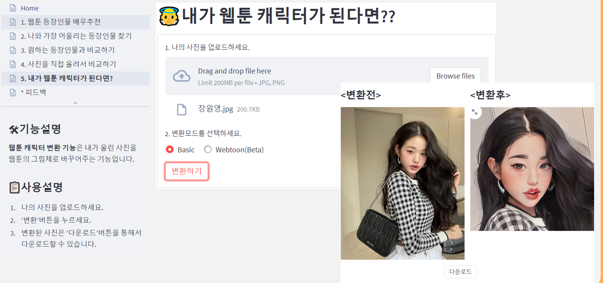

- 유저 피드백

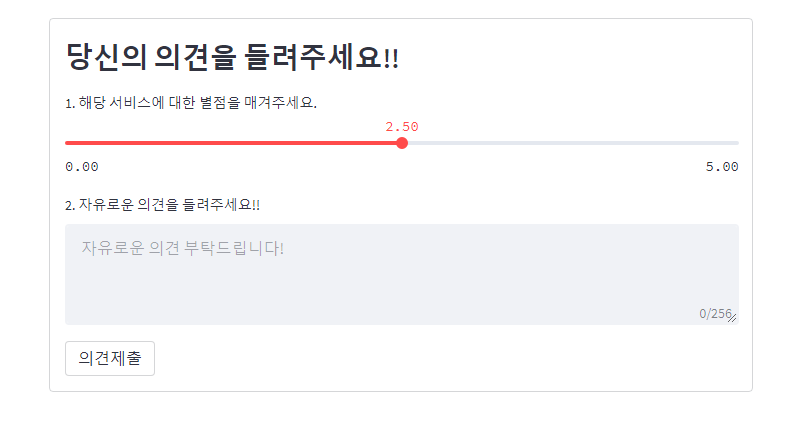

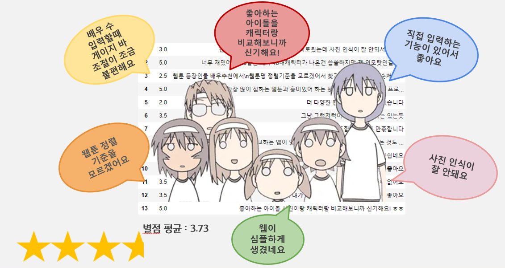

## :nut_and_bolt:사용 도구

1. Data Collection
   - Beautifulsoup
   - Requests
   - Selenium
2. Data Preprocessing
   1. Text
      - re
      - pandas
      - KoNLPy
   2. Image
      - Dlib
      - opencv
      - PIL
      - numpy
3. Modeling
   1. Text
      1. FastText
   2. Image
      1. TensorFlow
      2. PyTorch
4. Web Front-End & Back-End
   - Streamlit
5. Deploy
   - AWS

## :house:Stakeholder

- [김지원](https://github.com/jiwonn1e) - **P**roject **M**anager
  - Data collection
  - Data preprocessing(Text)
  - SBERT Model Test
- [박지성](https://github.com/wjsrlahrlco1998) - **P**roject **L**eader
  - Data collection
  - Data Preprocessing
  - AutoEncoder Model Training
  - Model & Function Modulization
  - Apply AI Model
  - Web Front-End & Back-End
- [구광모](https://github.com/koo-kwang-mo) - **P**roject **E**ngineer
  - Data collection
  - Data Preprocessing
  - FastText Model Training
  - SBERT Model Test
- [김동현](https://github.com/KiiiimDong) - **P**roject **E**ngineer
  - Data collection
  - Data Preprocessing
  - StyleGAN2 Model Training
- [정경희](https://github.com/k-hee803) - **P**roject **E**ngineer
  - Data collection
  - Data Preprocessing
  - FastText Model Training
  - SBERT Model Test
- [윤형섭](https://github.com/ch11t) - **P**roject **E**ngineer
  - Data collection
  - Web Front-End & Back-End

### :smile_cat: 프로젝트를 마치며...

*발전을 멈추지 말고 모두가 훌륭한 개발자가 되기를!!*