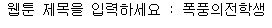
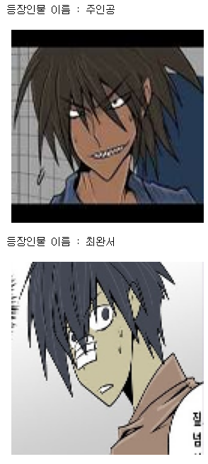
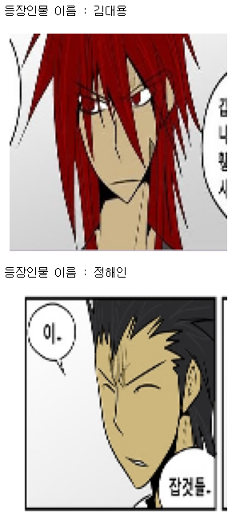
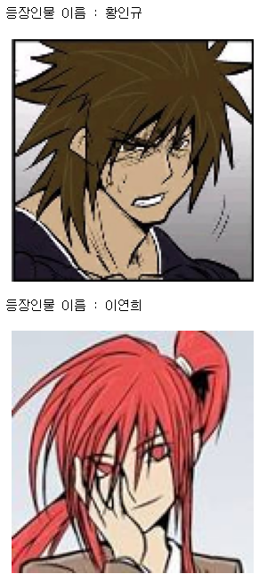
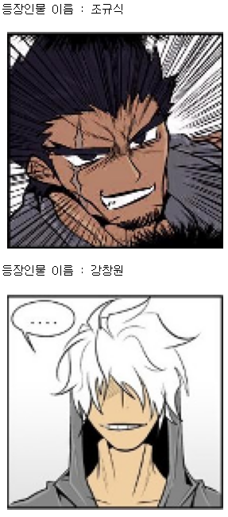
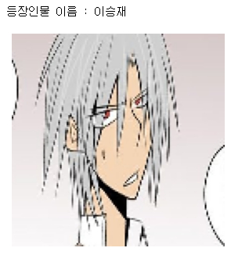
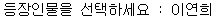
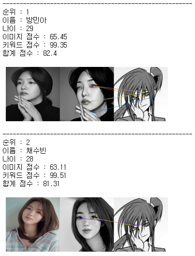
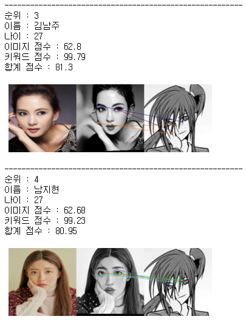

# 웹툰 드라마화 배우 추천 - version 0.1

*배우 추천 시스템의 프로토타입 version 0.1*

## 1. 동작 예시

### 1) 웹툰 제목 입력

### 2) 해당 웹툰의 등장인물과 이미지 출력

### 3) 등장인물 선택

### 4) 배우 추천

## 2. 개선방향

- 데이터 재정비
- 이미지 비교 모델 성능 개선 -> 현재는 찾지 못해서 도움이 필요.
  - 이미지 유사성 비교 모델 성능 지표 마련
- 키워드 유사성 비교 모델 성능 개선
  - 키워드 유사성 비교 모델 성능 지표 마련

